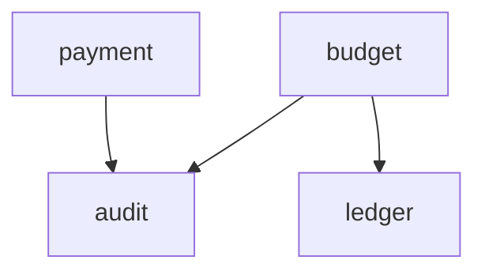

<!-- AUTO-GENERATED by scripts/generate-architecture-graph.sh -->
<!-- Do not edit manually. Regenerate with: ./scripts/generate-architecture-graph.sh -->
<!-- Generated: 2026-03-20T12:53:48Z -->

# Orbit Architecture Graph

## 1. Module Overview & Layer Completeness

| Module | api | core | infrastructure | exception |
|--------|-----|------|----------------|-----------|
| audit | ✓ | ✓ | ✓ | — |
| budget | ✓ | ✓ | ✓ | — |
| common | ✓ | ✓ | ✓ | ✓ |
| config | — | — | — | — |
| crypto | — | — | ✓ | — |
| integration | — | ✓ | ✓ | — |
| ledger | ✓ | ✓ | ✓ | — |
| payment | ✓ | ✓ | ✓ | — |
| security | ✓ | ✓ | ✓ | — |

## 2. Module Dependency Graph

